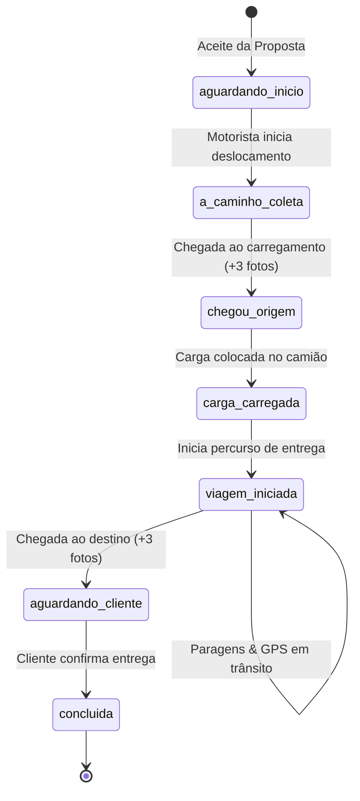

# 🚚 Documentação Completa: Viagens e Paragens (CargoLink / Fretix)

Esta documentação detalha a arquitetura, ciclo de vida, estados, endpoints, regras de negócio e fluxo operacional das **Viagens** e **Paragens** no ecossistema CargoLink.

---

## 📑 Índice
1. [Visão Geral e Arquitetura](#1-visão-geral-e-arquitetura)
2. [Máquina de Estados da Viagem](#2-máquina-de-estados-da-viagem)
3. [Ciclo de Vida Operacional (As 6 Etapas)](#3-ciclo-de-vida-operacional-as-6-etapas)
4. [Gestão de Paragens da Viagem (Trip Stops)](#4-gestão-de-paragens-da-viagem-trip-stops)
5. [Rastreamento GPS e Regras Anti-Sobrecarga](#5-rastreamento-gps-e-regras-anti-sobrecarga)
6. [Comprovações Fotográficas nas Chegadas](#6-comprovações-fotográficas-nas-chegadas)
7. [Referência Completa de Endpoints](#7-referência-completa-de-endpoints)
8. [Matriz de Permissões e Perfis](#8-matriz-de-permissões-e-perfis)

---

## 1. Visão Geral e Arquitetura

A **Viagem (`Trip`)** representa a execução física e logística do transporte de uma carga.
Ela **não é criada manualmente** via formulário, mas gerada automaticamente pelo sistema no momento em que:
* O **Cliente** aceita uma proposta enviada pela transportadora/motorista; ou
* Uma contraproposta é aceite por uma das partes.

### Modelos de Banco de Dados Envolvidos

```
  ┌─────────────┐       1:1       ┌─────────────┐
  │    Load     │ ─────────────── │    Trip     │
  └─────────────┘                 └─────────────┘
                                         │
        ┌──────────────────┬─────────────┴────────────┬──────────────────┐
        │ 1:N              │ 1:N                      │ 1:N              │ 1:N
        ▼                  ▼                          ▼                  ▼
┌───────────────┐  ┌───────────────┐          ┌───────────────┐  ┌───────────────┐
│ TripLocation  │  │   TripStop    │          │ TripActivity  │  │   TripPhoto   │
│ (Pontos GPS)  │  │  (Paragens)   │          │ (Histórico)   │  │ (Evidências)  │
└───────────────┘  └───────────────┘          └───────────────┘  └───────────────┘
```

| Tabela | Responsabilidade |
|---|---|
| `trips` | Registo mestre da viagem, vínculos (`load_id`, `company_id`, `driver_id`, `vehicle_id`), timestamps e status. |
| `trip_locations` | Histórico de telemetria e coordenadas GPS registradas ao longo da rota. |
| `trip_stops` | Paragens voluntárias ou obrigatórias (abastecimento, descanso, refeição, fiscalização, etc.). |
| `trip_activities` | Log cronológico de eventos e marcos da viagem para auditoria e linha do tempo do app. |
| `trip_photos` | Fotografias comprobatórias do local de chegada (recolha e entrega). |

---

## 2. Máquina de Estados da Viagem

O ciclo da viagem é sincronizado em tempo real com o status da carga correspondente (`Load`):



### Sincronismo de Status: `Trip` vs `Load`

| Status da Viagem (`trips.status`) | Status da Carga (`loads.status`) | Descrição Operacional |
|---|---|---|
| `aguardando_inicio` | `aceite` | Viagem criada; motorista atribuído ainda não iniciou deslocamento. |
| `a_caminho_coleta` | `a_caminho_coleta` | Motorista a conduzir até ao local onde a carga se encontra (origem). |
| `chegou_origem` | `chegou_origem` | Motorista no local da carga; aguarda carregamento (+ fotos comprobatórias). |
| `carga_carregada` | `carga_carregada` | Carga conferida e acomodada no veículo; pronta para viagem de estrada. |
| `viagem_iniciada` | `em_viagem` | Camião em trânsito com a carga em direção ao destino. |
| `aguardando_cliente` | `aguardando_cliente` | Motorista chegou ao destino final; aguarda validação e descarga (+ fotos). |
| `concluida` | `concluida` | Cliente validou a entrega; viagem encerrada com sucesso. |

---

## 3. Ciclo de Vida Operacional (As 6 Etapas)

### Etapa 1: Início do Deslocamento para Coleta
* **Ação do Motorista:** Clica em *"A caminho da Coleta"*.
* **Endpoints:**
  * `PATCH /driver/trips/{trip_id}/start-pickup`
  * `PATCH /trips/{trip_id}/start-pickup`
* **Efeito:**
  * `trip.status = "a_caminho_coleta"`
  * `trip.en_route_pickup_at = NOW()`
  * Emite notificação push ao cliente informando que o motorista está a caminho.

---

### Etapa 2: Chegada ao Ponto de Carregamento (Origem)
* **Ação do Motorista:** Ao estacionar no armazém/fábrica/fazenda do cliente, confirma a chegada.
* **Endpoints:**
  * `PATCH /driver/trips/{trip_id}/arrive-pickup`
  * `PATCH /trips/{trip_id}/arrive-pickup`
* **Evidência Obrigatória:** Mínimo de **3 fotografias** do local/instalações de carregamento.
* **Efeito:**
  * `trip.status = "chegou_origem"`
  * `trip.arrived_pickup_at = NOW()`
  * `load.status = "chegou_origem"`
  * Regista atividade no histórico da viagem.

---

### Etapa 3: Confirmação de Carga Carregada
* **Ação do Motorista:** Após a carga ser colocada no camião, amarrada e conferida a documentação.
* **Endpoints:**
  * `PATCH /driver/trips/{trip_id}/confirm-loaded`
  * `PATCH /trips/{trip_id}/confirm-loaded`
* **Efeito:**
  * `trip.status = "carga_carregada"`
  * `trip.loaded_at = NOW()`
  * `load.status = "carga_carregada"`

---

### Etapa 4: Início da Viagem de Entrega
* **Ação do Motorista:** Inicia a condução em rota rodoviária até ao destino final.
* **Endpoints:**
  * `PATCH /driver/trips/{trip_id}/start`
  * `PATCH /trips/{trip_id}/start`
* **Payload Opcional:**
  ```json
  {
    "vehicle_id": 10,
    "total_distance_km": 480.5,
    "estimated_time": "6h 30min"
  }
  ```
* **Efeito:**
  * `trip.status = "viagem_iniciada"`
  * `trip.started_at = NOW()`
  * `load.status = "em_viagem"`
  * Ativa o envio contínuo de coordenadas GPS e permite registo de paragens.

---

### Etapa 5: Chegada ao Destino (Descarga)
* **Ação do Motorista:** Ao atingir o endereço final da entrega, confirma chegada no destino.
* **Endpoints:**
  * `PATCH /driver/trips/{trip_id}/end` (ou `/arrive`)
  * `PATCH /trips/{trip_id}/arrive`
* **Evidência Obrigatória:** Mínimo de **3 fotografias** do local de destino/descarregamento.
* **Efeito:**
  * `trip.status = "aguardando_cliente"`
  * `trip.arrived_at = NOW()`
  * `load.status = "aguardando_cliente"`
  * Cliente é notificado para conferir a mercadoria e descarregar.

---

### Etapa 6: Conclusão e Aceite pelo Cliente
* **Ação do Cliente:** Após vistoriar a carga no local de entrega, o cliente confirma no seu app/web.
* **Endpoint:**
  * `PATCH /trips/{trip_id}/confirm`
* **Efeito:**
  * `trip.status = "concluida"`
  * `trip.client_confirmed_at = NOW()`
  * `trip.completed_at = NOW()`
  * `load.status = "concluida"`
  * Incrementa contador de viagens da empresa e do motorista (`total_viagens += 1`).
  * Desbloqueia avaliação mútua (`ratings`).

---

## 4. Gestão de Paragens da Viagem (Trip Stops)

Durante o trajeto (`viagem_iniciada`), o motorista pode registrar paragens para controle da transportadora e segurança da carga.

### Catálogo de Tipos de Paragem (`stop_type`)
* `abastecimento` — Paragem para abastecimento de diesel/combustível.
* `descanso` — Pernoite ou descanso obrigatório do motorista.
* `refeicao` — Almoço/jantar.
* `manutencao` — Manutenção preventiva ou corretiva / furo de pneu.
* `fiscalizacao` — Posto policial, balança rodoviária ou alfândega.
* `outro` — Outros motivos operacionais.

### Campos da Tabela `trip_stops`
```sql
id              SERIAL PRIMARY KEY,
trip_id         INTEGER REFERENCES trips(id) ON DELETE CASCADE,
tipo            VARCHAR(50) NOT NULL,
nome_local      VARCHAR(150),
endereco        TEXT,
observacao      TEXT,
latitude        NUMERIC(10, 7),
longitude       NUMERIC(10, 7),
stopped_at      TIMESTAMP DEFAULT CURRENT_TIMESTAMP,
resumed_at      TIMESTAMP,
created_at      TIMESTAMP DEFAULT CURRENT_TIMESTAMP
```

### Endpoints de Paragens

#### 1. Registar Paragem
* **Método:** `POST /driver/trips/{trip_id}/stops`
* **Payload:**
  ```json
  {
    "stop_type": "abastecimento",
    "location_name": "Posto Galp EN1 - Manhiça",
    "address": "Estrada Nacional nº 1, KM 75",
    "notes": "Abastecimento de 150L e calibragem de pneus",
    "latitude": -25.402311,
    "longitude": 32.809144
  }
  ```
* **Resposta (HTTP 201):**
  ```json
  {
    "id": 14,
    "trip_id": 5,
    "stop_type": "abastecimento",
    "location_name": "Posto Galp EN1 - Manhiça",
    "address": "Estrada Nacional nº 1, KM 75",
    "notes": "Abastecimento de 150L e calibragem de pneus",
    "latitude": -25.402311,
    "longitude": 32.809144,
    "stopped_at": "2026-09-07T13:10:00Z",
    "resumed_at": null,
    "created_at": "2026-09-07T13:10:00Z"
  }
  ```

#### 2. Retomar Viagem após Paragem
Quando o motorista volta à estrada, clica em *"Retomar Viagem"*:
* **Método:** `PATCH /driver/trips/{trip_id}/stops/{stop_id}/resume`
* **Payload:**
  ```json
  {
    "notes": "Viagem retomada após abastecimento"
  }
  ```
* **Efeito:**
  * Preenche `resumed_at = NOW()`.
  * Calcula e expõe a duração exata da paragem (`resumed_at - stopped_at`).
  * Registra evento cronológico na linha do tempo da viagem.

#### 3. Listar Paragens da Viagem
* **Método:** `GET /driver/trips/{trip_id}/stops`
* **Resposta:** Lista ordenada por data decrescente com todas as paragens e seus status.

---

## 5. Rastreamento GPS e Regras Anti-Sobrecarga

Durante a viagem, o aplicativo do motorista envia continuamente a telemetria em segundo plano:
* `POST /driver/trips/{trip_id}/locations` ou `POST /trips/{trip_id}/locations`

### Payload de Localização
```json
{
  "latitude": -25.965530,
  "longitude": 32.583210,
  "speed": 72.5,
  "traveled_distance_km": 145.8
}
```

### Algoritmo Anti-Sobrecarga do Backend
Para proteger a base de dados contra milhões de inserções desnecessárias com camião parado ou trânsito lento, o backend aplica os seguintes filtros inteligentes:

| Constante | Valor Padrão | Regra de Negócio |
|---|---|---|
| `TRIP_LOCATION_MIN_INTERVAL_SECONDS` | **10 segundos** | Ignora gravação de rota se o último ponto foi gravado há menos de 10 segundos. |
| `TRIP_LOCATION_MIN_DISTANCE_METERS` | **50 metros** | Exige deslocamento real de pelo menos 50 metros para gerar novo ponto na linha de rota. |
| `TRIP_LOCATION_HEARTBEAT_SECONDS` | **120 segundos** | Se o veículo estiver parado por mais de 2 minutos, grava um ponto de confirmação de vida (*heartbeat*). |

> ℹ️ **Nota:** Mesmo quando um ponto intermediário não é gravado na tabela de histórico `trip_locations`, a posição instantânea do motorista (`drivers.current_lat/lng`) e do veículo (`vehicles.current_lat/lng`) é **sempre atualizada imediatamente**.

---

## 6. Comprovações Fotográficas nas Chegadas

Para garantir a transparência logística e evitar disputas entre embarcador (cliente) e transportador:

### Regra Obrigatória
* **Mínimo:** **3 fotografias** do local em cada confirmação de chegada.
* **Validação:** A API rejeita com `HTTP 400 Bad Request` se menos de 3 fotos forem enviadas.

| Ponto de Chegada | Momento | O Que Fotografar |
|---|---|---|
| **1ª Chegada (Origem)** | `arrive-pickup` | Fachada/portaria do cliente, área de carga e camião posicionado para receber a mercadoria. |
| **2ª Chegada (Destino)** | `arrive` / `end` | Endereço de entrega, mercadoria descarregada/estacionamento e comprovativo de entrega assinado. |

---

## 7. Referência Completa de Endpoints

### Rotas Gerais (`/trips`)
| Método | Endpoint | Perfil Permitido | Descrição |
|---|---|---|---|
| `GET` | `/trips/me` | Todos autenticados | Lista viagens vinculadas ao usuário logado. |
| `GET` | `/trips/{id}` | Cliente, Empresa, Motorista, Admin | Detalhe completo da viagem com paragens e histórico. |
| `PATCH` | `/trips/{id}/start-pickup` | Motorista atribuído | Inicia deslocamento para recolha da carga. |
| `PATCH` | `/trips/{id}/arrive-pickup` | Motorista atribuído | Confirma chegada à origem (mínimo 3 fotos). |
| `PATCH` | `/trips/{id}/confirm-loaded` | Motorista atribuído | Confirma mercadoria carregada no veículo. |
| `PATCH` | `/trips/{id}/start` | Motorista atribuído | Inicia percurso de estrada até ao destino. |
| `PATCH` | `/trips/{id}/arrive` | Motorista atribuído | Confirma chegada ao destino (mínimo 3 fotos). |
| `PATCH` | `/trips/{id}/confirm` | Cliente dono da carga | Cliente valida e encerra a entrega. |
| `POST` | `/trips/{id}/locations` | Motorista atribuído | Envio de ponto GPS da viagem. |
| `GET` | `/trips/{id}/locations` | Participantes da viagem | Histórico de pontos para renderização de rota no mapa. |

### Rotas Otimizadas do App Motorista (`/driver/trips`)
| Método | Endpoint | Descrição |
|---|---|---|
| `GET` | `/driver/trips?group=em_andamento` | Viagens ativas do motorista com progresso em percentagem. |
| `GET` | `/driver/trips?group=concluidas` | Histórico de viagens concluídas pelo motorista. |
| `GET` | `/driver/trips/{id}` | Ecrã principal da viagem (status, paragens, cliente, contato). |
| `PATCH` | `/driver/trips/{id}/start-pickup` | Atalho: sair para carregar. |
| `PATCH` | `/driver/trips/{id}/arrive-pickup` | Atalho: cheguei ao carregamento. |
| `PATCH` | `/driver/trips/{id}/confirm-loaded` | Atalho: camião carregado. |
| `PATCH` | `/driver/trips/{id}/start` | Atalho: iniciar rota de entrega. |
| `PATCH` | `/driver/trips/{id}/end` | Atalho: cheguei ao destino / aguardando descarga. |
| `POST` | `/driver/trips/{id}/stops` | Registar paragem (abastecimento, descanso, etc.). |
| `PATCH` | `/driver/trips/{id}/stops/{stop_id}/resume` | Retomar viagem após paragem registrada. |
| `GET` | `/driver/trips/{id}/stops` | Listar todas as paragens desta viagem. |

---

## 8. Matriz de Permissões e Perfis

```text
┌──────────────────────────────────────┬─────────┬──────────┬───────────┬───────┐
│ Operação                             │ Cliente │ Empresa  │ Motorista │ Admin │
├──────────────────────────────────────┼─────────┼──────────┼───────────┼───────┤
│ Ver detalhes da viagem               │   Sim   │   Sim    │    Sim    │  Sim  │
│ Acompanhar GPS e mapa em tempo real  │   Sim   │   Sim    │    Sim    │  Sim  │
│ Iniciar deslocamento para coleta     │   Não   │   Não    │    Sim    │  Sim  │
│ Confirmar chegadas (Origem/Destino)  │   Não   │   Não    │    Sim    │  Sim  │
│ Confirmar carregamento               │   Não   │   Não    │    Sim    │  Sim  │
│ Iniciar viagem rodoviária            │   Não   │   Não    │    Sim    │  Sim  │
│ Registar e retomar paragens          │   Não   │   Não    │    Sim    │  Sim  │
│ Confirmar entrega final e recebimento│   Sim   │   Não    │    Não    │  Sim  │
└──────────────────────────────────────┴─────────┴──────────┴───────────┴───────┘
```
